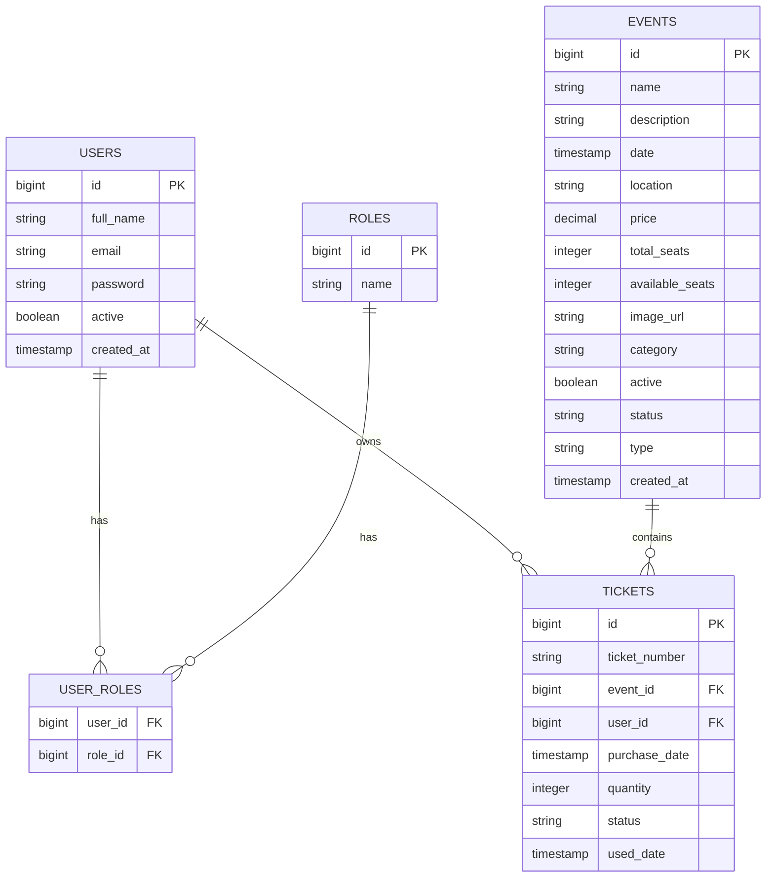

# Gestion de Billetterie (E-Billet)

Application de gestion de billetterie développée avec Spring Boot. Cette application permet la gestion complète d'événements et de billets avec une interface moderne et responsive.

## Prérequis

- Java 17 ou supérieur
- Maven 3.8+
- PostgreSQL 12+
- Node.js (pour TailwindCSS)

## Technologies utilisées

- **Backend**
  - Java 17
  - Spring Boot 3.4.0
  - Spring Security
  - Spring Data JPA
  - PostgreSQL

- **Frontend**
  - Thymeleaf
  - TailwindCSS
  - Alpine.js

## Installation

1. Cloner le projet : 
    ```bash
    git clone https://github.com/ndg23/e-billet.git
    cd e-billet
    ```

2. Configuration de la base de données :
   - Créer une base de données PostgreSQL nommée `gbillet`
   - Modifier `src/main/resources/application.properties` avec vos paramètres :
     ```properties
     spring.datasource.url=jdbc:postgresql://localhost:5432/gbillet
     spring.datasource.username=votre_username
     spring.datasource.password=votre_password
     ```

3. Compiler et lancer l'application :
    ```bash
    mvn clean install
    mvn spring-boot:run
    ```

4. Accéder à l'application : http://localhost:8080

## Comptes de test

- **Admin**
  - Email : admin@example.com
  - Mot de passe : Admin123@

- **Utilisateur**
  - Email : user@example.com
  - Mot de passe : User123@

## Fonctionnalités principales

### Gestion des événements
- Création, modification et suppression d'événements
- Catégorisation (Concert, Sport, Théâtre, etc.)
- Gestion des places disponibles
- Upload d'images

### Réservation de billets
- Réservation simple et intuitive
- Gestion des quantités
- Historique des réservations
- Statut des billets (Actif, Utilisé, Annulé)

### Interface d'administration
- Dashboard avec statistiques
- Gestion des utilisateurs
- Validation des billets
- Rapports d'activité

### Sécurité
- Authentification avec Spring Security
- Gestion des rôles (ADMIN, CUSTOMER)
- Protection CSRF
- Validation des données

## Choix techniques

### Architecture
- **MVC** : Pour une séparation claire des responsabilités
- **Spring Boot** : Pour sa facilité de configuration et son écosystème riche
- **Thymeleaf** : Pour l'intégration naturelle avec Spring et le rendu côté serveur
- **TailwindCSS** : Pour un design moderne et une personnalisation facile

### Base de données
- **PostgreSQL** : Pour sa fiabilité et ses fonctionnalités avancées
- **JPA/Hibernate** : Pour la persistance des données et l'ORM
- **Migrations** : Pour la gestion des changements de schéma

### Frontend
- **Alpine.js** : Pour l'interactivité légère sans framework complexe
- **Design responsive** : Compatible mobile et desktop
- **Style Apple** : Interface épurée et moderne

## Structure du projet
```
src/
├── main/
│   ├── java/com/gestion/
│   │   ├── config/        # Configuration Spring
│   │   ├── controller/    # Contrôleurs MVC
│   │   ├── model/        # Entités JPA
│   │   ├── repository/   # Repositories Spring Data
│   │   ├── service/      # Logique métier
│   │   └── security/     # Configuration sécurité
│   └── resources/
│       ├── templates/    # Templates Thymeleaf
│       └── static/       # Assets (CSS, JS, images)
```

## Auteur

[Ndong Allogho Antoine](https://github.com/ndg23)

## Licence

Ce projet est sous licence MIT.

## Structure de la base de données

### Schéma relationnel

```sql
-- Users (Utilisateurs)
CREATE TABLE users (
    id BIGSERIAL PRIMARY KEY,
    full_name VARCHAR(50) NOT NULL,
    email VARCHAR(255) NOT NULL UNIQUE,
    password VARCHAR(255) NOT NULL,
    active BOOLEAN DEFAULT true,
    created_at TIMESTAMP
);

-- Roles (Rôles)
CREATE TABLE roles (
    id BIGSERIAL PRIMARY KEY,
    name VARCHAR(50) NOT NULL UNIQUE
);

-- User_Roles (Association Utilisateurs-Rôles)
CREATE TABLE user_roles (
    user_id BIGINT REFERENCES users(id),
    role_id BIGINT REFERENCES roles(id),
    PRIMARY KEY (user_id, role_id)
);

-- Events (Événements)
CREATE TABLE events (
    id BIGSERIAL PRIMARY KEY,
    name VARCHAR(255) NOT NULL,
    description TEXT,
    date TIMESTAMP NOT NULL,
    location VARCHAR(255) NOT NULL,
    price DECIMAL(10,2) NOT NULL,
    total_seats INTEGER NOT NULL,
    available_seats INTEGER NOT NULL,
    image_url VARCHAR(255),
    category VARCHAR(50) NOT NULL,
    active BOOLEAN DEFAULT true,
    status VARCHAR(20) NOT NULL,
    type VARCHAR(50) NOT NULL,
    created_at TIMESTAMP
);

-- Tickets (Billets)
CREATE TABLE tickets (
    id BIGSERIAL PRIMARY KEY,
    ticket_number VARCHAR(255) NOT NULL UNIQUE,
    event_id BIGINT REFERENCES events(id),
    user_id BIGINT REFERENCES users(id),
    purchase_date TIMESTAMP NOT NULL,
    quantity INTEGER NOT NULL DEFAULT 1,
    status VARCHAR(20) NOT NULL,
    used_date TIMESTAMP
);
```

### Diagramme de relations



### Relations principales

1. **Users - Roles** (Many-to-Many)
   - Un utilisateur peut avoir plusieurs rôles
   - Un rôle peut être attribué à plusieurs utilisateurs

2. **Users - Tickets** (One-to-Many)
   - Un utilisateur peut avoir plusieurs billets
   - Un billet appartient à un seul utilisateur

3. **Events - Tickets** (One-to-Many)
   - Un événement peut avoir plusieurs billets
   - Un billet correspond à un seul événement

### Contraintes importantes

- Emails uniques pour les utilisateurs
- Numéros de billets uniques
- Statuts prédéfinis pour les billets (ACTIVE, USED, CANCELLED)
- Catégories prédéfinies pour les événements
- Contraintes de clés étrangères avec suppression en cascade
- Contraintes de validation sur les quantités et prix
